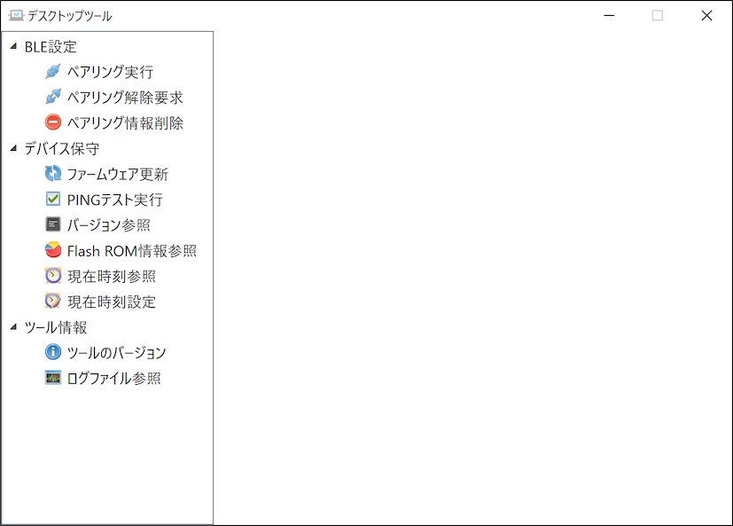
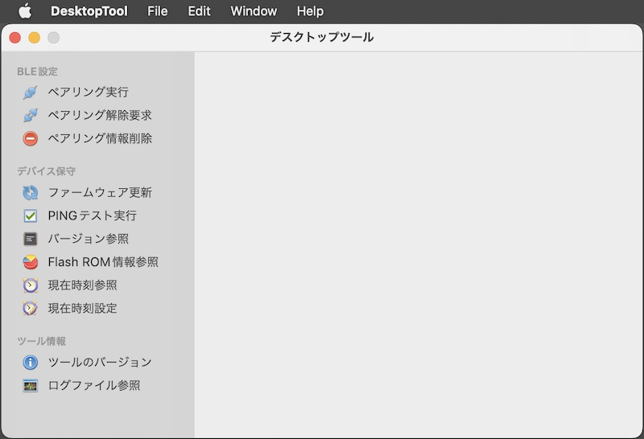

# デスクトップツール

最終更新日：2024/2/29

## 概要
PC環境から、nRF5340基板の動作に必要な各種設定／動作テスト等を行うためのツールです。 
[Windows版](../DesktopTools/dotNET/README.md)と、[macOS版](../DesktopTools/macOSApp/README.md)を用意しました。

## エンドユーザー向けの機能

* ペアリング実行
* ペアリング解除要求
* ペアリング情報削除
* ファームウェア更新
* PINGテスト実行
* バージョン参照
* Flash ROM情報参照
* 現在時刻参照／設定
* ログファイル参照

## ベンダー向けの機能
（後日制作予定）

## [Windows版](../DesktopTools/dotNET/README.md)

#### 画面イメージ

#### 動作環境
Windows 10 (64bit版)、Windows 11

## [macOS版](../DesktopTools/macOSApp/README.md)

#### 画面イメージ

#### 動作環境
macOS Monterey (Version 12)〜  
最終更新日現在、Intel mac版のみ用意しています。Apple siliconには未対応です。
