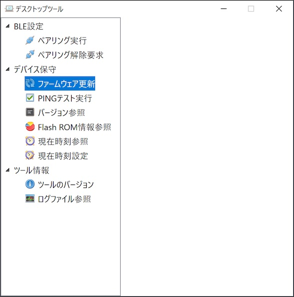
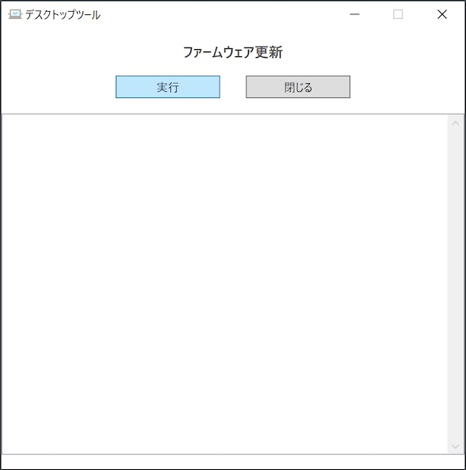
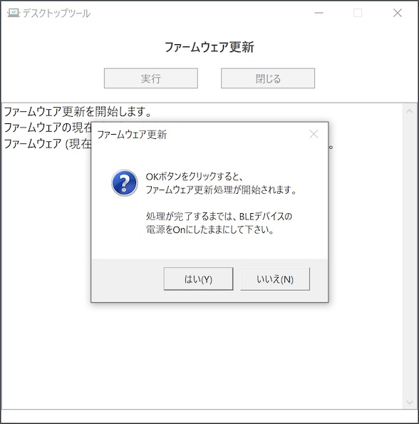
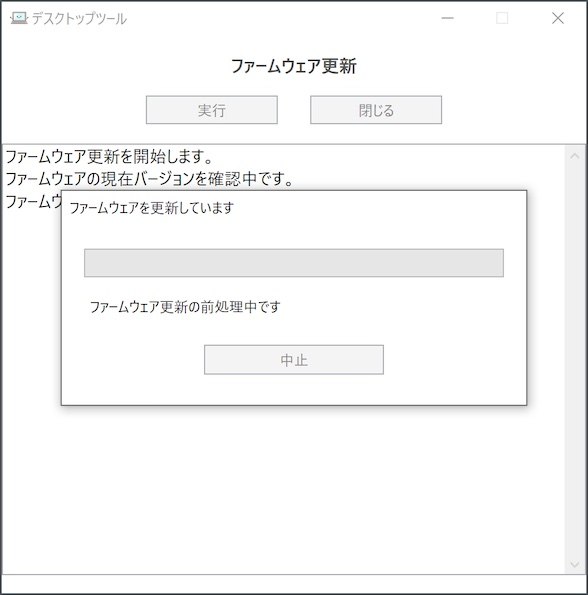
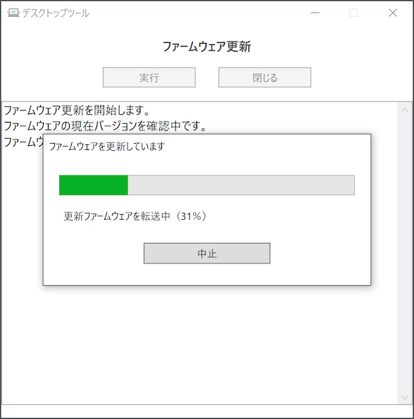
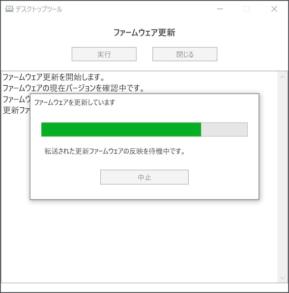

# ファームウェア更新手順書

最終更新日：2024/3/28

## 概要

デスクトップツールを使用して、PC環境から、nRF5340基板のファームウェアを更新する手順について掲載しています。

## 手順

デスクトップツールの左側メニュー「ファームウェア更新」をクリックします。

ツール画面右側に、ファームウェア更新画面が表示されますので「実行」をクリックします。

ファームウェア更新のための前処理が実行されるので、しばらく待ちます。

ファームウェア更新処理を開始する前に、確認メッセージがポップアップ表示されます。 
「はい」ボタンをクリックすると、ファームウェア更新処理が開始されます。

ファームウェア更新処理が開始されると、更新処理の進捗表示画面がポップアップ表示されます。

ほどなく、デスクトップツールに同梱された、最新のファームウェア更新イメージデータが、nRF5340基板へ転送されます。

ファームウェア更新イメージデータの転送が完了すると、転送されたファームウェアを反映するため、nRF5340基板が自動的に再始動されます。 
デスクトップツール側では、下図のようなメッセージを表示し、ファームウェア反映処理が完了するまで待機します。

デスクトップツールは最後に、ファームウェアのバージョンを確認し、更新ファームウェアが正しく反映されたかどうかチェックします。 
チェックが正常であれば、ファームウェア更新が成功した旨のメッセージが表示されます。

以上で、ファームウェア更新は完了となります。
