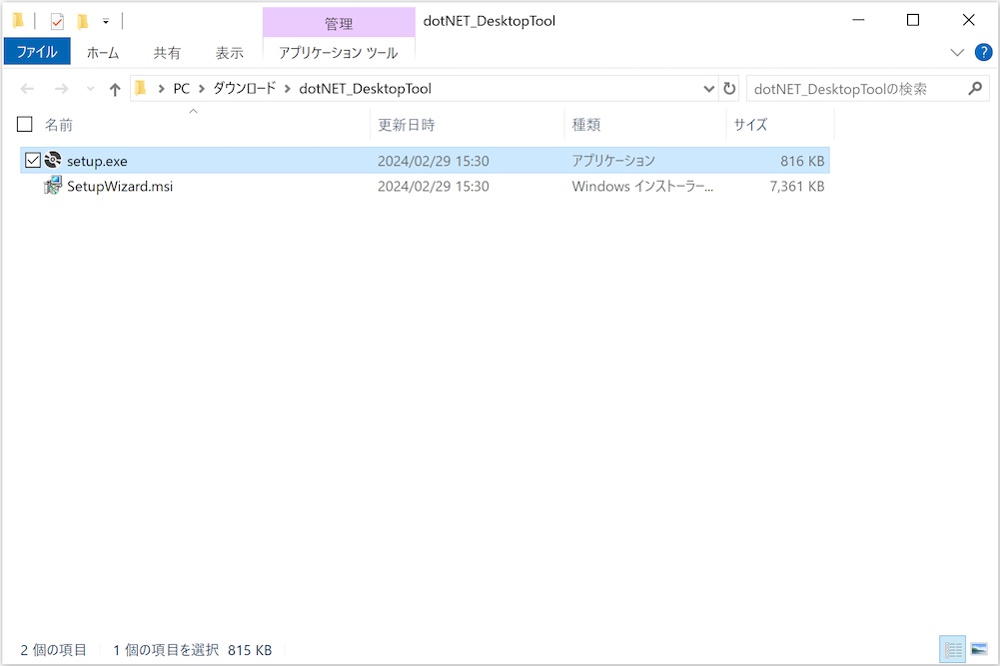

# インストール手順書

最終更新日：2024/2/29

## 概要
デスクトップツールをWindows環境にインストールする手順について掲載しています。

## インストール媒体の取得

[Windows版 デスクトップツール](../../../DesktopTools/dotNET/DesktopTool/dotNET_DesktopTool.zip)を、GitHubからダウンロード／解凍します。 
該当ページの「Download」ボタンをクリックすると、[dotNET_DesktopTool.zip](../../../DesktopTools/dotNET/DesktopTool/dotNET_DesktopTool.zip)がダウンロードできます。

ダウンロードが完了したら、ダウンロードフォルダーを開きます。 
次に、ダウンロードしたファイル`dotNET_DesktopTool.zip`を解凍してください。

解凍された`setup.exe`と`SetupWizard.msi`の２点のファイルが、インストール媒体になります。

## インストールの実行

前述の実行ファイル`setup.exe`をダブルクリックして実行してください。

最終更新日現在、アプリに署名がされていないため、ダウンロードしたプログラムを実行できない旨のダイアログが表示されます。 
「詳細情報」をクリックします。

画面表示が変わり「実行」ボタンが表示されますので、その「実行」ボタンをクリックします。

インストーラーが起動しますので、指示に従いインストールを進めます。

インストールが正常に完了したら「閉じる」をクリックし、インストーラーを終了させます。

Windowsのスタートメニューに、アイコン「SquareDevices Desktop Tool」が表示されることを確認します。 
アイコンを右クリックし、インストールされたデスクトップツールを実行します。

「アプリがデバイスに変更を加えることを許可しますか？」というメッセージが表示されます。[注1] 
「はい」ボタンをクリックすると、ツールが起動します。

デスクトップツールの画面が起動すれば、インストールは完了です。

[注1] Windows 10のバージョン「Windows 10 November 2019 Update」以降においては、管理者として実行されていないプログラムの場合、BLEデバイスとの直接的なBluetooth通信ができない仕様となったようです。Windows版デスクトップツールでは、BLEデバイスとの直接的なBluetooth通信が必要なため、管理者として実行させるようにしております。その影響で、ツール起動のたびに「アプリがデバイスに変更を加えることを許可しますか？」というメッセージが表示されてしまいますが（下図ご参照）、不具合ではありません。

