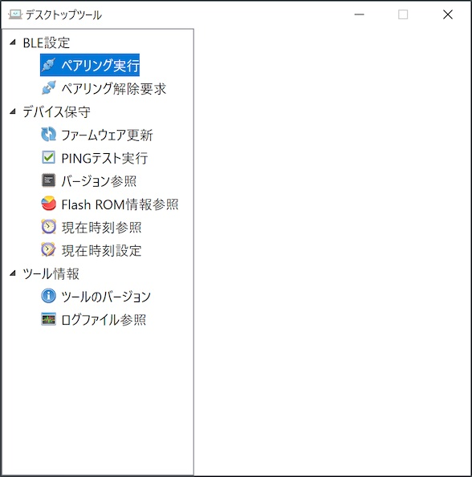
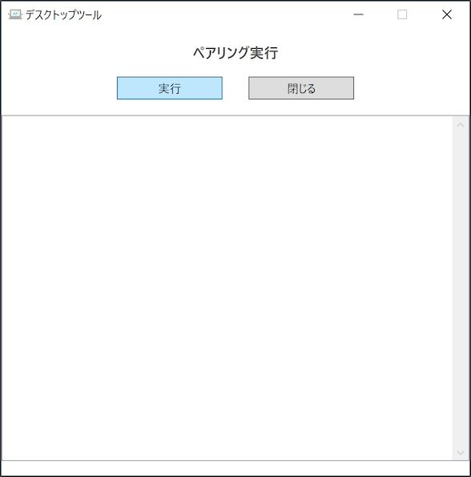
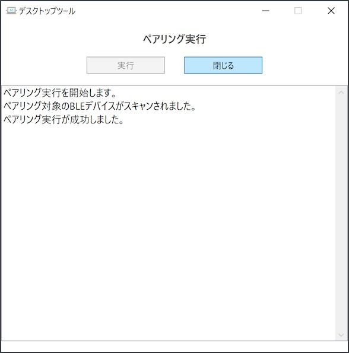
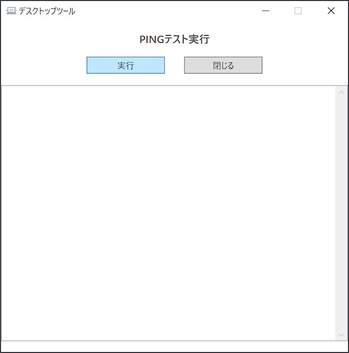
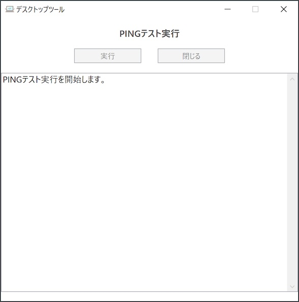
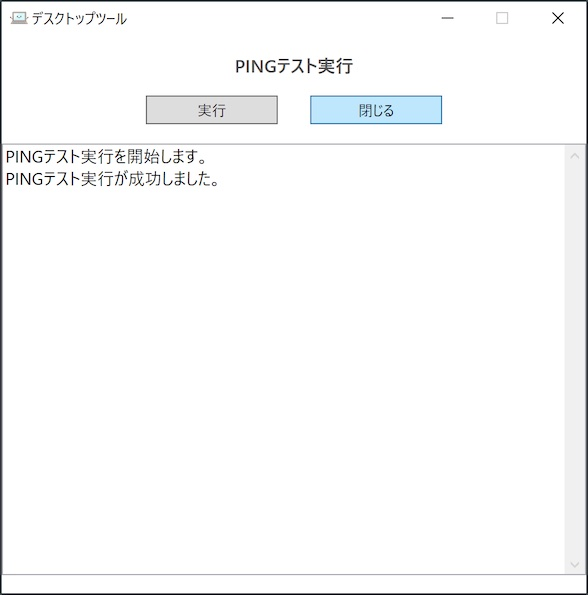
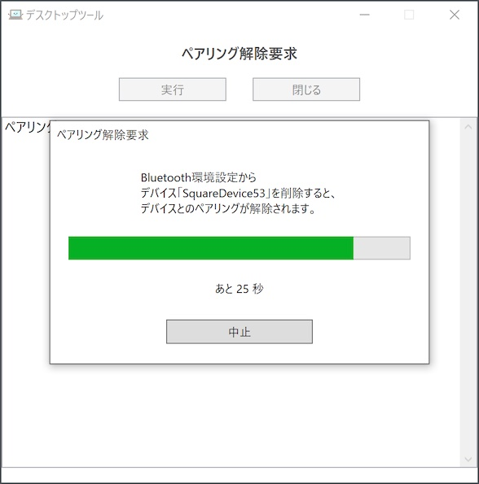
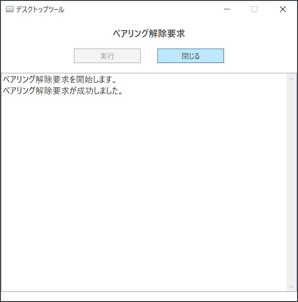

# ペアリング手順書

最終更新日：2024/3/18

## 概要

デスクトップツールを使用して、PC環境にnRF5340基板をペアリングする手順について掲載しています。

## ペアリングの実行

ペアリングを実行したのち、PC〜nRF5340基板との接続確認を行います。

### ペアリング

デスクトップツールの左側メニュー「ペアリング実行」をクリックします。

ツール画面右側に、ペアリング実行画面が表示されますので「実行」をクリックします。

パスコード入力画面がポップアップ表示されます。 
nRF5340基板がTFTディスプレイに表示したパスコード（６桁の数字）を入力し「ペアリング実行」ボタンをクリックします。

ペアリング処理が開始されますので、そのまま待ちます。 
ペアリング処理が正常終了すると、下図のようなメッセージが表示され、処理が成功したことを知らせます。

「閉じる」ボタンをクリックし、ペアリング実行画面を閉じます。

WindowsのBluetooth設定画面を開き「SquareDevice53」が表示されている事を確認します。

### 接続確認

デスクトップツールからPINGテスト[注1]を実行すると、PC〜nRF5340基板間の接続確認を行うことができます。 
デスクトップツールの左側メニュー「PINGテスト実行」をクリックします。

ツール画面右側に、PINGテスト実行画面が表示されますので「実行」をクリックします。

PINGテストが開始されますので、そのまま待ちます。

PINGテストが正常終了すると、下図のようなメッセージが表示され、処理が成功したことを知らせます。 
「閉じる」ボタンをクリックし、PINGテスト実行画面を閉じます。

以上で、ペアリングの実行は完了です。

[注1] PINGテストとは、デスクトップツールが送信した任意のデータをnRF5340基板が受信後、そのまま無編集でデータをデスクトップツールに送信し、デスクトップツール側で送信データと受信データが完全一致するかどうかを確認するテストです。

## ペアリング解除の実行

PC環境とnRF5340基板のペアリングを解除するには、ペアリング解除要求を実行します。 
デスクトップツールの左側メニュー「ペアリング解除要求」をクリックします。

ツール画面右側に、ペアリング解除要求画面が表示されますので「実行」をクリックします。

解除要求を待機するメッセージが、残り秒数を表示するバーと一緒にポップアップ表示されます。

上図メッセージが表示されている間に、WindowsのBluetooth設定画面から「SquareDevice53」を選択します。 
「デバイスの削除」ボタンが表示されるので、ボタンをクリックします。

確認メッセージがポップアップ表示されるので「はい」をクリックします。

WindowsのBluetooth設定画面から「SquareDevice53」が消去され、nRF5340基板とのペアリングが解除されたことを確認します。

一方、デスクトップツール側でも下図のようなメッセージが表示され、ペアリング解除要求処理が成功したことを知らせます。

以上で、ペアリング解除の実行は完了です。
