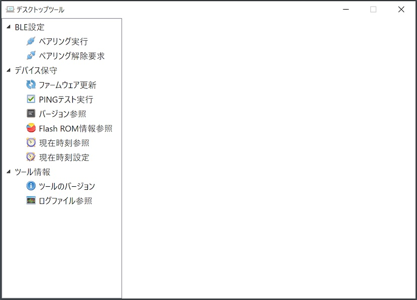

# Windows版 デスクトップツール

最終更新日：2024/3/14

## 概要
PC環境から、nRF5340基板の動作に必要な各種設定／動作テスト等を行うためのツールです。

### 動作環境
Windows 10（64bit、November 2019 Update以降のバージョン） 
Windows 11

## 機能

* ペアリング実行
* ペアリング解除要求
* ペアリング情報削除
* ファームウェア更新
* PINGテスト実行
* バージョン参照
* Flash ROM情報参照
* 現在時刻参照／設定
* ログファイル参照

### 画面イメージ

### 手順書

- <b>[インストール手順書](../../../Markdowns/DesktopTools/dotNET/INSTALL.md)</b> 
デスクトップツールをWindows環境にインストールする手順について掲載しています。

- <b>[ペアリング手順書](../../../Markdowns/DesktopTools/dotNET/PAIRING.md)</b> 
デスクトップツールを使用して、PC環境にnRF5340基板をペアリングする手順について掲載しています。

- <b>[現在時刻参照／設定手順書](../../../Markdowns/DesktopTools/dotNET/TIMESET.md)</b> 
デスクトップツールを使用して、PC環境から、nRF5340基板の現在時刻を参照／設定する手順について掲載しています。

- <b>[ログファイル参照手順書](../../../Markdowns/DesktopTools/dotNET/VIEWLOG.md)</b> 
デスクトップツールから出力されるログファイルの参照手順について説明しています。
