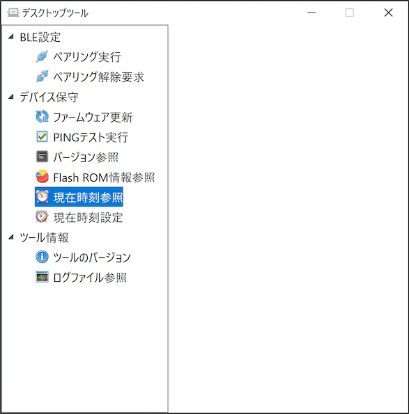
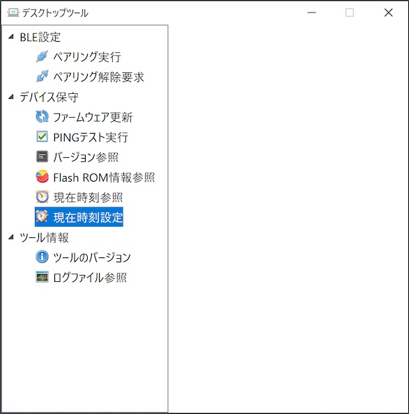
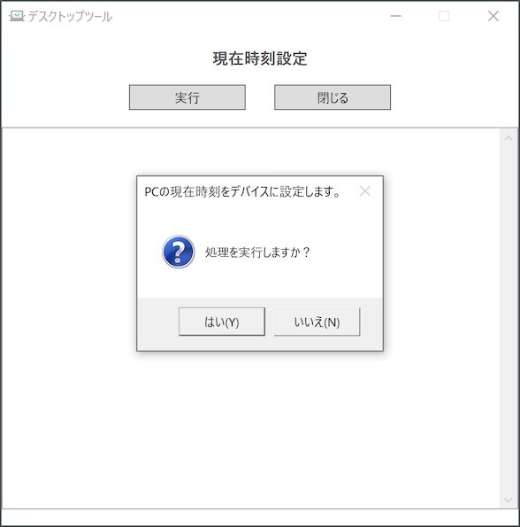
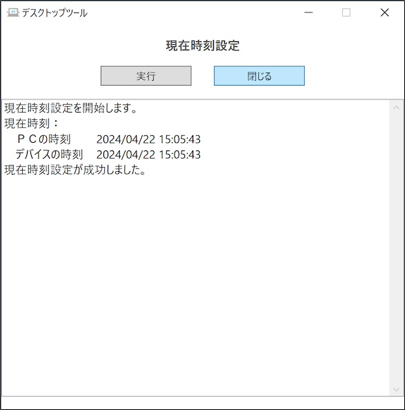

# 現在時刻参照／設定手順書

最終更新日：2024/3/4

## 概要

デスクトップツールを使用して、PC環境から、nRF5340基板の現在時刻を参照／設定する手順について掲載しています。

## 時刻設定手順

デスクトップツールにより、nRF5340基板の現在時刻参照または設定ができます。 
nRF5340基板のボタンを押下し、稼働状態（基板上のLEDが点滅している状態）である事を確認します。

### 現在時刻の参照

デスクトップツールの左側メニュー「現在時刻参照」をクリックします

ツール画面右側に、現在時刻参照画面が表示されますので「実行」をクリックします。

程なく、nRF5340基板から取得した現在時刻と、取得時点におけるPC（デスクトップツール）の現在時刻を確認できます。

これで、現在時刻の参照は完了です。

### 現在時刻の設定

デスクトップツールの左側メニュー「現在時刻設定」をクリックします

ツール画面右側に、現在時刻設定画面が表示されますので「実行」をクリックします。

下図のような確認ポップアップ表示されますので「はい」をクリックします。

程なく、nRF5340基板に登録された現在時刻と、登録時点におけるPC（デスクトップツール）の現在時刻を確認できます。

これで、現在時刻の設定は完了です。
