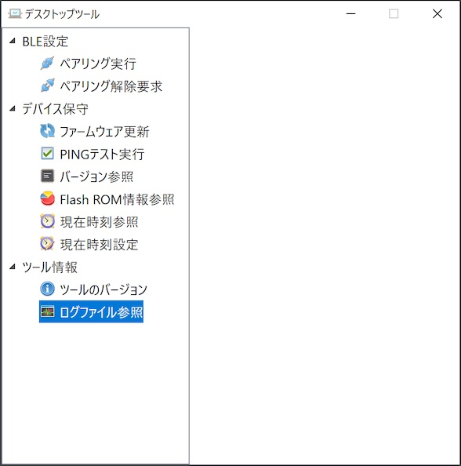

# ログファイル参照手順書

## 概要
デスクトップツールから出力されるログファイルの参照手順について説明しています。

## ログファイルの場所

デスクトップツールの実行中に出力されるログは、Windowsのユーザーディレクトリー配下のログファイル（下記の場所）に保存されます。

`%LOCALAPPDATA%\makmorit\SquareDevices\DesktopTool.log`

具体的には、例えば `C:\Users\user\AppData\Local\makmorit\SquareDevices\DesktopTool.log` といったパスになります。

### ログファイルの場所を開く

ログファイルの格納場所を、Windowsのエクスプローラで開くことができます。<br>
デスクトップツールを起動し「ログファイル参照」ボタンをクリックします。



ログファイル`DesktopTool.log`を格納するディレクトリーが、Windowsのエクスプローラで表示されます。


ログファイルは通常のテキストファイルですので、適宜、テキストエディターにより内容を参照することが可能です。

## ログファイルの内容

Windowsアプリの一般的な形式で出力されます。<br>
ログの出力イメージは以下のようになります。

```
2024/02/29 15:53:27 [info] デスクトップツールを起動しました: Version 0.1.0.014
2024/02/29 15:53:33 [info] PINGテスト実行を開始します。
2024/02/29 15:53:34 [debug] Watch BLE device advertisement start
2024/02/29 15:53:34 [debug] BLE device found.
2024/02/29 15:53:34 [debug] Service data field not found
2024/02/29 15:53:34 [debug] BLE device found.
2024/02/29 15:53:34 [debug] Service data field not found
2024/02/29 15:53:35 [debug] Watch BLE device advertisement end
2024/02/29 15:53:35 [info] 対象のBLEデバイスがスキャンされました。
2024/02/29 15:53:35 [info] BLEサービス(0000fffd-0000-1000-8000-00805f9b34fb)を検索します。
2024/02/29 15:53:35 [debug]   BLE service found [SquareDevice53]
2024/02/29 15:53:35 [info] BLEサービスが見つかりました。
2024/02/29 15:53:36 [debug] Connection status changed: BLE device is connected
2024/02/29 15:53:36 [info] 受信データの監視を開始します。(SquareDevice53)
2024/02/29 15:53:36 [info] BLEデバイスに接続しました。
2024/02/29 15:53:36 [debug] BLE Sent INIT frame: data size=100 length=61
81 00 64 d9 02 12 4d 1e 19 60 34 a6 93 b0 ff 25
82 7d fc e6 2a 16 f6 c0 6e af dc 7a d9 bc 60 57
93 d7 df b7 01 f7 1f 4a ff 0a d6 d8 c6 3c 9a c8
1a 13 e7 85 5b 61 c6 e6 56 9e 4f 68 ba d0 64 be
2024/02/29 15:53:36 [debug] BLE Sent CONT frame: data seq=0 length=39
00 14 6b 7a 87 99 ce 0a b8 97 87 7c 5a db 7b 0c
c0 d3 7e b3 03 60 d3 5c 6a ae ce f1 e0 57 1b 80
4a 9a d9 fa 45 c4 c1 ab
2024/02/29 15:53:36 [debug] BLE Recv INIT frame: data size=100 length=61
81 00 64 d9 02 12 4d 1e 19 60 34 a6 93 b0 ff 25
82 7d fc e6 2a 16 f6 c0 6e af dc 7a d9 bc 60 57
93 d7 df b7 01 f7 1f 4a ff 0a d6 d8 c6 3c 9a c8
1a 13 e7 85 5b 61 c6 e6 56 9e 4f 68 ba d0 64 be
2024/02/29 15:53:36 [debug] BLE Recv CONT frame: seq=0 length=39
00 14 6b 7a 87 99 ce 0a b8 97 87 7c 5a db 7b 0c
c0 d3 7e b3 03 60 d3 5c 6a ae ce f1 e0 57 1b 80
4a 9a d9 fa 45 c4 c1 ab
2024/02/29 15:53:36 [info] BLEデバイスから切断しました。
2024/02/29 15:53:36 [info] PINGテスト実行が成功しました。
2024/02/29 15:56:01 [info] デスクトップツールを終了しました
```
