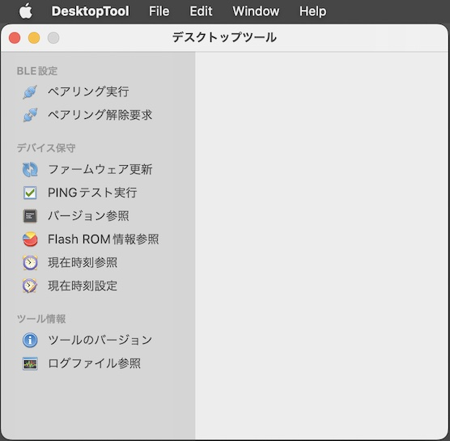

# インストール手順書

最終更新日：2024/5/3

## 概要
デスクトップツールをmacOS環境にインストールする手順について掲載しています。

## インストール媒体の取得

[macOS版 デスクトップツール](../../../DesktopTools/macOSApp/packages/x86/DesktopTool_x86.pkg)を、GitHubからダウンロード／解凍します。 
該当ページの「Download」ボタンをクリックすると、[DesktopTool_x86.pkg](../../../DesktopTools/macOSApp/packages/x86/DesktopTool_x86.pkg)がダウンロードできます。

ダウンロードが完了したら、ダウンロードフォルダーを開きます。 
ダウンロードしたファイル`DesktopTool_x86.pkg`が、インストール媒体になります。

## インストールの実行

前述のファイル`DesktopTool_x86.pkg`を右クリックし、メニュー「開く」を実行してください。

最終更新日現在、アプリに署名がされていないため、下図のようなポップアップ警告が表示されます。 
「開く」をクリックします。

インストーラーが起動しますので、指示に従いインストールを進めます。

インストールが正常に完了したら「閉じる」をクリックし、インストーラーを終了させます。

下図のようなポップアップが表示されたら「ゴミ箱に入れる」をクリックして、インストーラーを削除します。

macOSのアプリケーションフォルダーに、アイコン「DesktopTool」が表示されることを確認します。 
アイコンをダブルクリックし、インストールされたデスクトップツールを実行します。

デスクトップツールの画面が起動すれば、インストールは完了です。

