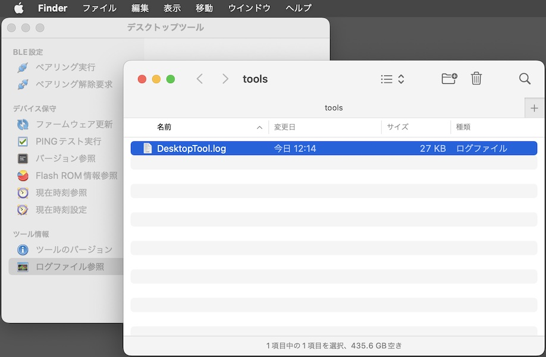

# ログファイル参照手順書

## 概要
デスクトップツールから出力されるログファイルの参照手順について説明しています。

## ログファイルの場所

デスクトップツールの実行中に出力されるログは、macOSのユーザーディレクトリー配下のログファイル（下記の場所）に保存されます。

`${HOME}/Library/Logs/makmorit/tools/DesktopTool.log`

具体的には、例えば `/Users/user/Library/Logs/makmorit/tools/DesktopTool.log` といったパスになります。

### ログファイルの場所を開く

ログファイルの格納場所を、macOSのFinderで開くことができます。<br>
デスクトップツールを起動し「ログファイル参照」ボタンをクリックします。


ログファイル`DesktopTool.log`を格納するディレクトリーが、macOSのFinderで表示されます。



ログファイルは通常のテキストファイルですので、適宜、テキストエディターにより内容を参照することが可能です。

## ログファイルの内容

macOSアプリの一般的な形式で出力されます。<br>
ログの出力イメージは以下のようになります。

```
2024-04-01 13:52:18.454 [info] デスクトップツールを起動しました: Version 0.1.0(23)
2024-04-01 13:52:24.322 [info] PINGテスト実行を開始します。
2024-04-01 13:52:24.323 [debug] スキャンを開始します。
2024-04-01 13:52:24.934 [debug] スキャンを停止しました。
2024-04-01 13:52:24.934 [info] 対象のBLEデバイスがスキャンされました。
2024-04-01 13:52:25.301 [info] BLEデバイスに接続しました。
2024-04-01 13:52:25.301 [info] BLEサービス(0000FFFD-0000-1000-8000-00805f9b34fb)を検索します。
2024-04-01 13:52:25.360 [debug] Found service FFFD
2024-04-01 13:52:25.361 [info] BLEサービスが見つかりました。
2024-04-01 13:52:25.361 [debug] Found characteristic F1D0FFF2-DEAA-ECEE-B42F-C9BA7ED623BB as Notify
2024-04-01 13:52:25.361 [debug] Found characteristic F1D0FFF1-DEAA-ECEE-B42F-C9BA7ED623BB as Write
2024-04-01 13:52:25.362 [debug] Found characteristic F1D0FFF1-DEAA-ECEE-B42F-C9BA7ED623BB as WriteWithoutResponse
2024-04-01 13:52:25.378 [info] 受信データの監視を開始します。
2024-04-01 13:52:25.379 [debug] BLE Sent INIT frame: data size=100 length=61
81 00 64 8a 14 50 21 29 2c 9e 96 f7 7d 95 e5 e1
91 39 d6 96 22 93 f8 3a 20 7d 3b 36 18 43 53 0b
f3 42 8c 1e 0c 5d 6e 9b 74 a1 8b 29 4d ec 53 6a
b4 af 82 0b fa 18 80 89 07 38 90 80 c7 b2 23 d0
2024-04-01 13:52:25.379 [debug] BLE Sent CONT frame: seq=0 length=39
00 ee b0 30 cf 23 38 15 5a 32 98 5e 18 9d ae 39
6e c5 46 86 13 99 73 f3 8c 24 34 be 25 fd 75 5b
9f c1 e7 d8 9d 9a ac 82
2024-04-01 13:52:25.448 [debug] BLE Recv INIT frame: data size=100 length=61
81 00 64 8a 14 50 21 29 2c 9e 96 f7 7d 95 e5 e1
91 39 d6 96 22 93 f8 3a 20 7d 3b 36 18 43 53 0b
f3 42 8c 1e 0c 5d 6e 9b 74 a1 8b 29 4d ec 53 6a
b4 af 82 0b fa 18 80 89 07 38 90 80 c7 b2 23 d0
2024-04-01 13:52:25.469 [debug] BLE Recv CONT frame: seq=0 length=39
00 ee b0 30 cf 23 38 15 5a 32 98 5e 18 9d ae 39
6e c5 46 86 13 99 73 f3 8c 24 34 be 25 fd 75 5b
9f c1 e7 d8 9d 9a ac 82
2024-04-01 13:52:25.470 [info] PINGテスト実行が成功しました。
2024-04-01 13:52:25.470 [info] BLEデバイスから切断しました。
2024-04-01 13:52:31.282 [info] デスクトップツールを終了しました。
```
