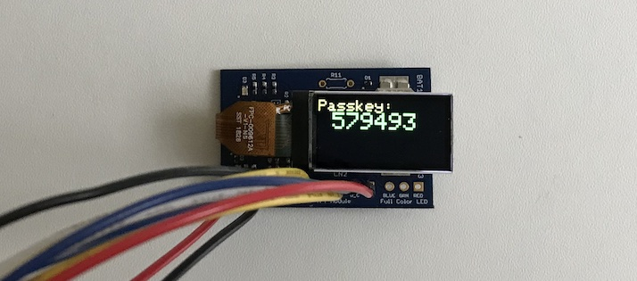

# Tiny TFT Library

最終更新日：2024/4/12

## 概要
超小型TFTディスプレイを、nRF5340をはじめとするマイコン基板に接続するためのライブラリーです。 
プラットフォーム（nRF Connect SDK）に依存する部分と、依存しない部分に分かれています。

## 前提

FORMIKE製の超小型TFTディスプレイ「KWH009ST02-F01」を接続する前提としております。 
「KWH009ST02-F01」については下記リンクご参照 
https://www.wandisplay.com/jp/products/KWH009ST02-F01.html

## 構成

#### モジュール一覧（プラットフォーム非依存）

配置場所 --> [Firmwares](../../Firmwares)

|#|モジュール名|説明|
|:---:|:---|:---|
|1|[`tiny_tft_lib/tiny_tft_const`](../../Firmwares/tiny_tft_lib/tiny_tft_const.c)|固定コードされたコマンド／データバイト配列|
|2|[`tiny_tft_lib/tiny_tft_define`](../../Firmwares/tiny_tft_lib/tiny_tft_define.h)|共通利用ヘッダー|
|3|[`tiny_tft_lib/tiny_tft_util`](../../Firmwares/tiny_tft_lib/tiny_tft_util.c)|ユーティリティーモジュール|
|4|[`tiny_tft_lib/tiny_tft`](../../Firmwares/tiny_tft_lib/tiny_tft.c)|エントリーモジュール|
|5|[`wrapper_header/wrapper_tiny_tft_define`](../../Firmwares/wrapper_header/wrapper_tiny_tft_define.h)|ラッパーモジュールで使用する定数定義[注1]|
|6|[`wrapper_header/wrapper_tiny_tft`](../../Firmwares/wrapper_header/wrapper_tiny_tft.h)|ラッパーヘッダー[注1]|

#### モジュール一覧（プラットフォーム依存）

<b>【nRF Connect SDK用】</b>

配置場所 --> [nRF5340FW/square_devices_app](../../nRF5340FW/square_devices_app)

|#|モジュール名|説明|
|:---:|:---|:---|
|1|[`wrapper/wrapper_tiny_tft`](../../nRF5340FW/square_devices_app/wrapper/wrapper_tiny_tft.c)|ラッパーモジュール[注1]|
|2|[`app/app_tiny_tft_define`](../../nRF5340FW/square_devices_app/app/app_tiny_tft_define.h)|定数定義|
|3|[`app/app_tiny_tft`](../../nRF5340FW/square_devices_app/app/app_tiny_tft.c)|SPI設定／GPIO設定／データ送受信処理|

[注1] プラットフォーム依存／非依存モジュール間の差異を吸収させるためのヘッダーファイル。ラッパーヘッダーに定義されている関数は、ラッパーモジュールに実装します。

## 仕様
Tiny TFT Libraryに関する仕様は以下になります。

### 主な仕様

|#|項目|説明|補足|
|:---:|:---|:---|:---|
|1|描画領域|80 x 160 pixel|縦長モード時|
|2|描画色|65,535色（16ビットRGB）|R=5ビット、G=6ビット、B=5ビット|
|3|描画方向|横長／縦長モード|左右／上下の反転が可能|
|4|描画フォント|ラスターフォント （１文字の表示領域＝[5 x 7 pixel]）|フォント置換えはサポートしていません。|

### テキスト描画機能
本ライブラリーでサポートする、テキスト描画機能は下記になります。

|#|関数名|説明|パラメーター|
|:---:|:---|:---|:---|
|1|`tiny_tft_set_text_wrap`|画面右端における折り返し有無を設定します。|`true`:テキストを折り返す `false`:テキストを折り返さない|
|2|`tiny_tft_set_cursor`|テキスト描画開始位置を設定します。|`x`,`y`:テキスト描画開始位置のpixel座標|
|3|`tiny_tft_set_text_color`|テキスト描画色を設定します。|テキストの描画色（フォント色）|
|4|`tiny_tft_set_text_size`|テキスト描画サイズ（倍率）を指定します。|１倍＝[5 x 7 pixel]分の大きさ|
|5|`tiny_tft_print`|画面上にテキストを描画します。|描画する文字列|

#### フォント色
テキストの描画色（フォント色）は、16ビットRGBで指定します。 
フォント色の例は以下になります。

|色名称|値|
|:---|:---:|
|`BLACK`|`0x0000`|
|`WHITE`|`0xFFFF`|
|`RED`|`0xF800`|
|`GREEN`|`0x07E0`|
|`BLUE`|`0x001F`|
|`CYAN`|`0x07FF`|
|`MAGENTA`|`0xF81F`|
|`YELLOW`|`0xFFE0`|
|`ORANGE`|`0xFC00`|

### グラフィックス機能
本ライブラリーでサポートする、グラフィックス機能は下記になります。

|#|関数名|説明|パラメーター|
|:---:|:---|:---|:---|
|1|`tiny_tft_fill_screen`|画面全体を、指定した色のpixelで塗り潰します。|pixelの描画色[注1]|

[注1] 前述の表「フォント色」に掲載した色と同様、16ビットRGBによる指定になります。

### 接続仕様

TFT〜nRF5340基板間の配線は以下になります。

|TFT||nRF5基板|説明|
|:--|:--:|:--|:--|
|#1（LEDA）|<--|`P1.09`|LEDバックライト用電源[注1]|
|#2（GND）|<--|`GND`|0V|
|#3（RESET）|<--|`P1.11`|TFTのリセット|
|#4（D/C）|<--|`P1.10`|データ／コマンド切替え|
|#5（SDA）|<--|`P1.13`|データ入力|
|#6（SCL）|<--|`P1.15`|クロック入力|
|#7（VDD）|<--|`VDD`|動作電圧入力|
|#8（CS）|<--|`P1.12`|TFT通信開始|

[注1] モジュール側（LEDA）側には、LEDバックライト用電源を入力しますが、nRF5340側はバックライトを点灯／消灯するロジック電圧（バックライト制御信号、low-active）を出力します。このため、実際に実装する基板には、制御信号によりLEDバックライト用電源をOn／Offするためのスイッチ回路が必要となります。

