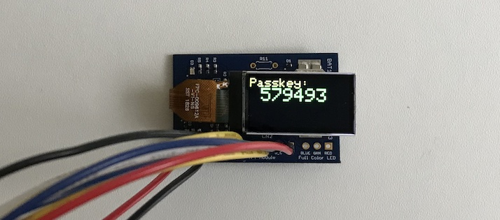

# MDBT53V-DB用拡張基板

最終更新日：2024/7/15

## 概要

MDBT53V-DBに、超小型TFTディスプレイ、RTCC（リアルタイムクロック・カレンダー）を接続するための拡張基板について掲載しています。

## 接続デバイス

- <b>超小型TFTディスプレイ</b> 
FORMIKE製の超小型TFTディスプレイ「KWH009ST02-F01」を、変換コネクター経由で接続します。

- <b>RTCC（リアルタイムクロック・カレンダー）</b> 
基板上に、Micro Crystal社のモジュール「RV-3028-C7」を搭載しています。

### 超小型TFTディスプレイ

拡張基板には、FORMIKE製の超小型TFTディスプレイ「KWH009ST02-F01」を接続するための変換コネクターを装備しています。 
「KWH009ST02-F01」については下記リンクご参照 
https://www.wandisplay.com/jp/products/KWH009ST02-F01.html

#### 特色
- 外形寸法：`28`mm x `14`mm
- 表示領域：`21.7`mm x `10.8`mm（`0.96`inch）
- 白色バックライトLEDを装備
- 動作電圧：`2.75`V（`3.3V`までなら動作可能）
- 消費電力：`62mW`（`3.0`Vで動作時）
- SPI接続

#### 接続方法

拡張基板に搭載のFPCコネクター（8pin, 0.5mm pitch）経由で、nRF5340の汎用I/O端子に接続します。 
TFT〜nRF5340間の配線は以下になります。

|TFT||nRF5基板|説明|
|:--|:--:|:--|:--|
|#1（LEDA）|<--|`P1.09`|LEDバックライト用電源[注1]|
|#2（GND）|<--|`GND`|0V|
|#3（RESET）|<--|`P1.11`|TFTのリセット|
|#4（D/C）|<--|`P1.10`|データ／コマンド切替え|
|#5（SDA）|<--|`P1.13`|データ入力|
|#6（SCL）|<--|`P1.15`|クロック入力|
|#7（VDD）|<--|`VDD`|動作電圧入力|
|#8（CS）|<--|`P1.12`|TFT通信開始|

[注1] モジュール側（LEDA）側には、LEDバックライト用電源を入力しますが、nRF5340側はバックライトを点灯／消灯するロジック電圧（バックライト制御信号、low-active）を出力します。このため、拡張基板には、制御信号によりLEDバックライト用電源をOn／Offするためのスイッチ回路を搭載します。

