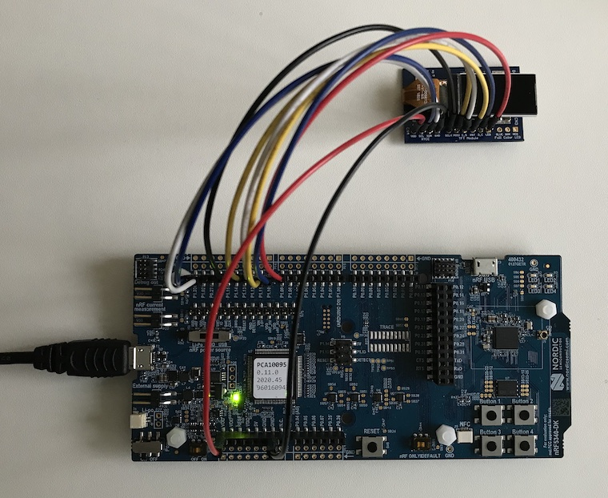

# nRF5340基板の製作

最終更新日：2024/7/15

## 概要

Nordic社のSoC「nRF5340」を使用したBLEデバイスを製作しています。

## 評価基板

最終更新日現在、Nordic社から販売されている「nRF5340 DK」、および数点の周辺部材から成る「MDBT53V-DB用拡張基板」を用意し、ファームウェア、デスクトップツールの制作に使用しています。 
nRF5340 DKについては下記リンクご参照 
https://www.nordicsemi.com/Products/Development-hardware/nrf5340-dk

### 特徴
- BLEペリフェラルデバイスとして動作
- 超小型TFTディスプレイを装備し、BLEペアリングのためのパスワード（６桁数字のパスコード）の参照が可能
- リアルタイムクロック・カレンダーモジュールを装備し、現在時刻の設定／参照が可能
- その他、LED3点（３色LED想定）、ボタン２点（タクトスイッチ想定）を装備
- USB接続についてはサポート無し

### [MDBT53V-DB用拡張基板](../../Markdowns/Hardwares/MDBT53VDBEXT.md)

MDBT53V-DBに、超小型TFTディスプレイ、RTCC（リアルタイムクロック・カレンダー）を接続するための拡張基板です。

## 製作中の基板

### [MDBT53 Slim Board](../../Hardwares/MDBT53SlimBoard)
Nordic社のSoC「nRF5340」を使用したBLEデバイスです。 
日本国内の技適取得済みであるnRF5340搭載モジュール「MDBT53」を使用します。 
小型ボタン乾電池（CR1225）で駆動し、BLEペリフェラルデバイスとして動作します。
