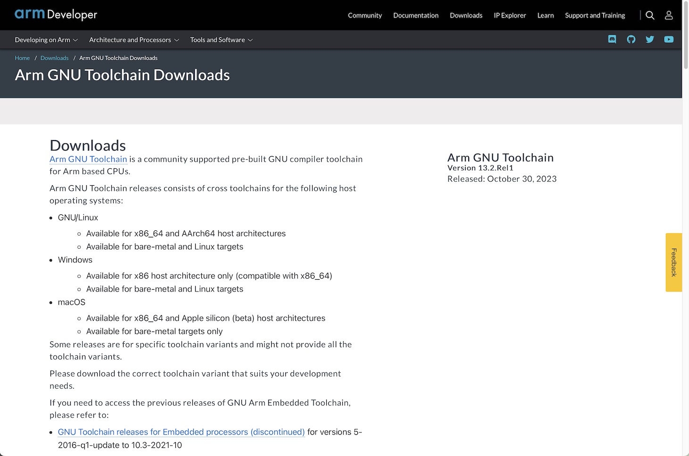
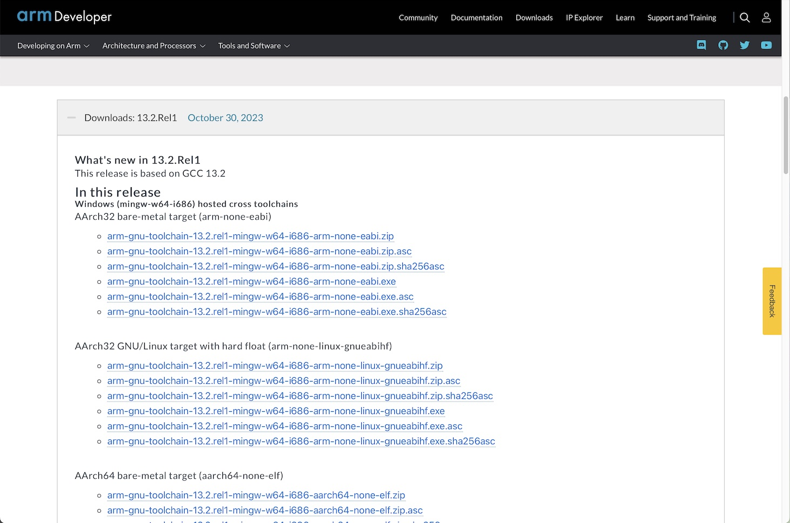
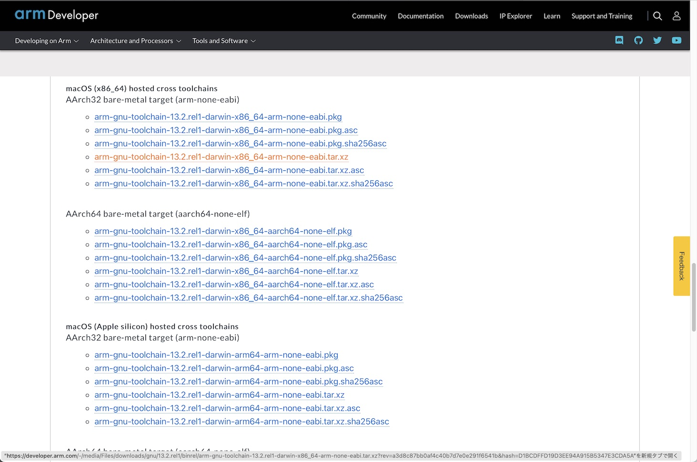

# ARM GCCインストール手順

最終更新日：2024/02/12

ARM GCCツールチェインをmacOS環境にインストールする手順について記載します。

## 使用したシステム

PC: iMac (Retina 5K, 27-inch, 2019)<br>
OS: macOS 12.7.2

## インストール用媒体の取得

こちらのサイトにアクセスします。<br>
https://developer.arm.com/downloads/-/arm-gnu-toolchain-downloads<br>
下図のような画面に遷移します。



少し下にスクロールし「Downloads: 12.2.Rel1」のリンクを開きます。<br>
インストール用媒体（ファイル）のリストが表示されます。



下にスクロールすると、macOS用のインストール媒体がリストされています。<br>
リンク「`arm-gnu-toolchain-13.2.rel1-darwin-x86_64-arm-none-eabi.tar.xz`」をクリックすると、ダウンロードが開始されます。[注1]



ダウンロードされたファイル「`arm-gnu-toolchain-13.2.rel1-darwin-x86_64-arm-none-eabi.tar.xz`」を使用し、次章以降で配置作業を進めます。

[注1] 今回使用したシステムに合わせたインストール媒体を使用しています。

## ARM GCCツールチェインの配置

ARM GCCツールチェインを、任意のフォルダーに配置します。<br>
以下は `${HOME}/opt` というディレクトリー配下に配置する例になります。

ターミナルを開き、以下のコマンドを実行します。

```
mkdir -p ${HOME}/opt
cd ${HOME}/opt
tar xjvf ${HOME}/Downloads/arm-gnu-toolchain-12.2.rel1-darwin-x86_64-arm-none-eabi.tar.xz
```

以下は実行例になります。

```
iMac-makmorit-jp:~ makmorit$ mkdir -p ${HOME}/opt
iMac-makmorit-jp:~ makmorit$ cd ${HOME}/opt
iMac-makmorit-jp:opt makmorit$ tar xjvf ${HOME}/Downloads/arm-gnu-toolchain-13.2.rel1-darwin-x86_64-arm-none-eabi.tar.xz
x arm-gnu-toolchain-13.2.Rel1-darwin-x86_64-arm-none-eabi/
x arm-gnu-toolchain-13.2.Rel1-darwin-x86_64-arm-none-eabi/bin/
x arm-gnu-toolchain-13.2.Rel1-darwin-x86_64-arm-none-eabi/libexec/
x arm-gnu-toolchain-13.2.Rel1-darwin-x86_64-arm-none-eabi/arm-none-eabi/
：
x arm-gnu-toolchain-13.2.Rel1-darwin-x86_64-arm-none-eabi/bin/arm-none-eabi-size
x arm-gnu-toolchain-13.2.Rel1-darwin-x86_64-arm-none-eabi/bin/arm-none-eabi-readelf
x arm-gnu-toolchain-13.2.Rel1-darwin-x86_64-arm-none-eabi/bin/arm-none-eabi-elfedit
x arm-gnu-toolchain-13.2.Rel1-darwin-x86_64-arm-none-eabi/bin/arm-none-eabi-gfortran
iMac-makmorit-jp:opt makmorit$
```

以上で、ARM GCCツールチェインのインストールは完了となります。
