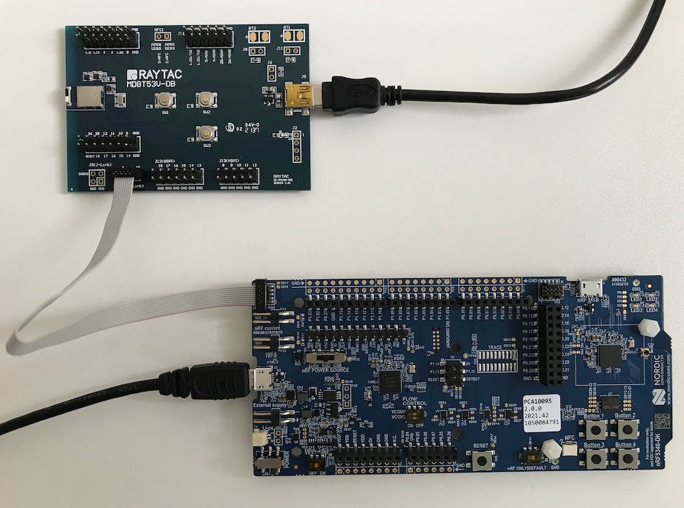
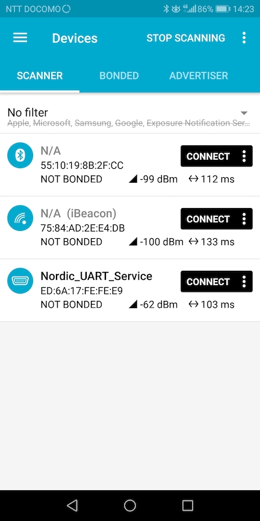
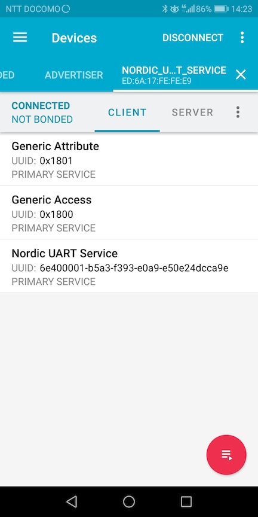
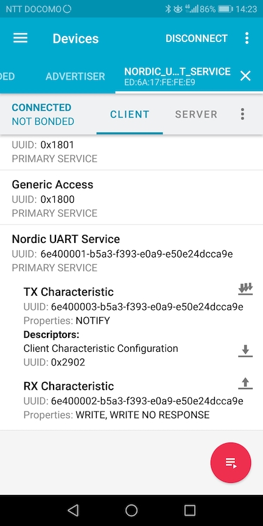
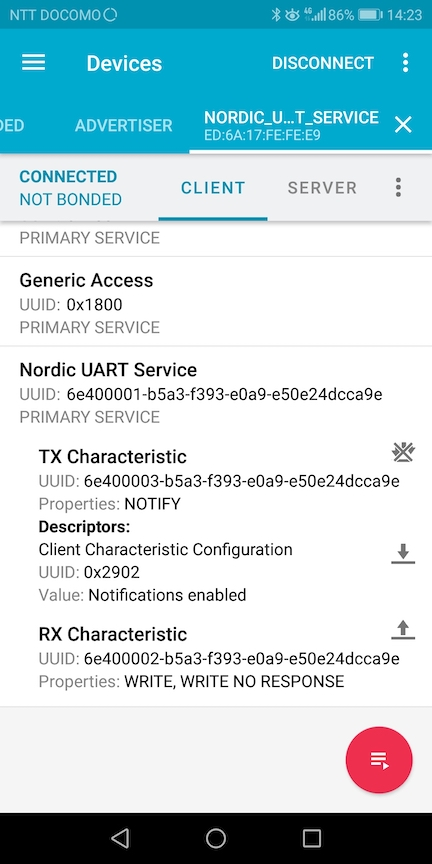
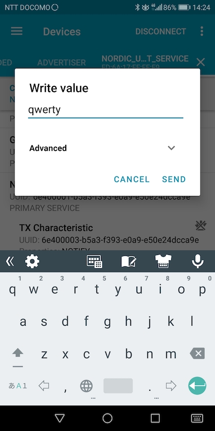
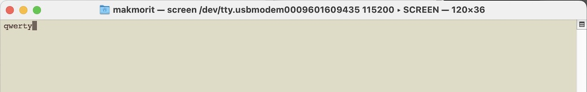
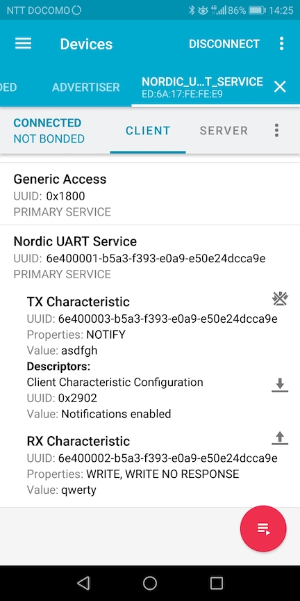
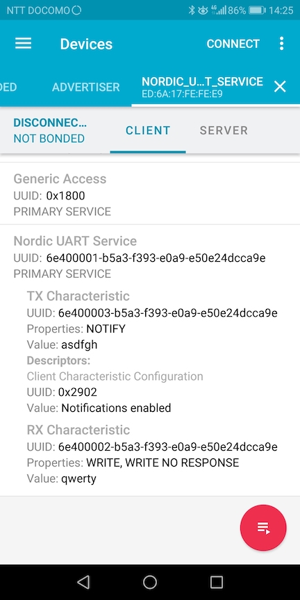

# nRF Connect SDK動作確認手順書（MDBT53V-DB）

最終更新日：2024/06/17

macOSにインストールされた「[nRF Connect SDK v2.6.1](https://developer.nordicsemi.com/nRF_Connect_SDK/doc/2.6.1/nrf/index.html)」の動作確認手順について掲載します。

## 使用したシステム

PC: iMac (Retina 5K, 27-inch, 2019)<br>
OS: macOS 12.7.2<br>
（サンプルアプリのビルド／書き込み環境として使用）

開発ボード: [nRF5340 DK](https://www.nordicsemi.com/Products/Development-hardware/nrf5340-dk)<br>
（サンプルアプリの転送元として使用）

開発ボード: [MDBT53V-DB-40](https://www.raytac.com/product/ins.php?index_id=140)<br>
（サンプルアプリの書き込み先として使用）

スマートフォン: HUAWEI nova lite 2<br>
OS: Android 8.0.0<br>
（サンプルアプリの動作確認時に使用）

## 手順の概要

- <b>ソフトウェアのインストール</b><br>
本手順書で必要となる各種ソフトウェアを、macOSにインストールします。

- <b>サンプルアプリのビルド</b><br>
Nordic社から公開されているサンプルアプリ「[Peripheral UART](https://developer.nordicsemi.com/nRF_Connect_SDK/doc/2.6.1/nrf/samples/bluetooth/peripheral_uart/README.html)」を、nRF Connect SDKでビルドします。

- <b>サンプルアプリの書込み</b><br>
開発ボードに搭載されているnRF5340を初期化した後、ビルドしたサンプルアプリを、開発ボードに書込みます。

- <b>サンプルアプリの動作確認</b><br>
Androidアプリ「nRF Connect」を使用し、開発ボードに書き込んだ「Peripheral UART」が正常に動作することを確認します。

## サンプルアプリのビルド

Nordic社から公開されているサンプルアプリ「Peripheral UART」を、nRF Connect SDKでビルドします。

### サンプルアプリのコピー

nRF Connect SDKのサンプルアプリを、適宜フォルダーにコピーします。

```
bash-3.2$ cd ${HOME}/GitHub/SquareDevices/nRF5340FW/
bash-3.2$ cp -pr ${HOME}/opt/ncs_2.6.1/nrf/samples/bluetooth/peripheral_uart .
bash-3.2$ ls -al
total 24
:
drwxr-xr-x  17 makmorit  staff    544  6 13 11:58 peripheral_uart
:
bash-3.2$
```

### ビルド用スクリプトを配置（要：一部書き換え）

ビルド用スクリプト`westbuild.sh`を作成し、プロジェクトフォルダー配下に配置したのち、実行権限を付与します。<br>
（実行時のスクリプト`westbuild.sh`は<b>[こちら](scripts/westbuild.sh)</b>）

```
bash-3.2$ cd ${HOME}/GitHub/SquareDevices/nRF5340FW/peripheral_uart
bash-3.2$ ls -al
total 128
:
-rw-r--r--   1 makmorit  staff    882  6 13 14:09 westbuild.sh
bash-3.2$ chmod +x westbuild.sh
bash-3.2$ ls -al
total 128
:
-rwxr-xr-x   1 makmorit  staff    882  6 13 14:09 westbuild.sh
bash-3.2$

```

### ビルド実行

ビルド用スクリプト`westbuild.sh`を実行し、プロジェクトをビルド（コンパイル、リンク）します。<br>
（実行時のログ`westbuild.log`は<b>[こちら](logs/westbuild.log)</b>）

```
bash-3.2$ cd ${HOME}/GitHub/SquareDevices/nRF5340FW/peripheral_uart
bash-3.2$ ./westbuild.sh > westbuild.log 2>&1
bash-3.2$ echo $?
0
bash-3.2$
```

以上で、サンプルアプリのビルドは完了です。

## サンプルアプリの書込み

nRF5340を初期化した後、ビルドしたサンプルアプリを、nRF5340に書込みます。

### 開発ボードとnRF5340 DKを接続

開発ボードに搭載されているnRF5340に、ビルドしたサンプルアプリを書き込むため、nRF5340 DKをJ-Linkデバイスとして使用します。<br>
すなわち、PCとnRF5340 DK（J-Linkデバイス）を、USBケーブルを使って接続し、その上で、nRF5340 DKと開発ボードを、J-Link用のケーブル（10pin）を使用して接続します。

下図は接続例になります。<br>
注意点としては、開発ボード（下図、左上の小さいボード）に、USBケーブルを使用し、別途電源を供給する必要があります。



### 開発ボードのnRF5340 Flash ROMを初期化

サンプルアプリを書き込みする前に、開発ボードに搭載されているnRF5340のFlash ROMを初期化します。

[nRF Connect for Desktop](https://www.nordicsemi.com/Products/Development-tools/nrf-connect-for-desktop/download)のProgrammerというアプリを使用すると、nRF5340のFlash ROMに書き込まれているプログラムやデータ等が一括削除できます。<br>
手順につきましては、別ドキュメント「[nRF5340 DK初期化手順書](../../Markdowns/nRF5340FW/NRFDKINIT.md)」をご参照願います。

### 書込み

ビルド用スクリプト`westbuild.sh -f`を実行し、ビルドしたファームウェアを、nRF5340に書込みます。<br>
（実行例は<b>[こちら](logs/westbuild-f.log)</b>）

```
bash-3.2$ cd ${HOME}/GitHub/SquareDevices/nRF5340FW/peripheral_uart
bash-3.2$ ./westbuild.sh -f
-- west flash: rebuilding
:
-- west flash: using runner nrfjprog
:
-- runners.nrfjprog: Board with serial number 1050084791 flashed successfully.
bash-3.2$
```

### ファームウェア起動確認（要：ログ内容をあらためて確認）

USBケーブルを使用してnRF5340 DKとPCを接続し、`screen`コマンドでデバッグプリントを監視すると、ファームウェア書込み完了後に以下のようなログが出力されます。<br>
（表示されない場合は、nRF5340 DKのRESETボタンを１回押下してください）

```
bash-3.2$ screen /dev/tty.usbmodem0010500847913 115200

*** Booting nRF Connect SDK v3.5.99-ncs1-1 ***
Starting Nordic UART service example
```

以上で、サンプルアプリの書込みは完了です。

## サンプルアプリの動作確認

Androidアプリ「nRF Connect」を使用し、nRF5340に書き込んだ「Peripheral UART」が正常に動作することを確認します。

### サービスに接続

Androidアプリ「nRF Connect」を起動します。<br>
デバイス一覧に「Nordic_UART_Service」がリストされていることを確認します。

その後、右横の「CONNECT」ボタンをタップします。



サービス一覧が表示されます。<br>
一覧の中から「Nordic UART Service」をタップします。



下部に３点のキャラクタリスティックが一覧表示されます。<br>
「TX Charactaristic」の右横のアイコンをタップします。



DescriptorsのValueが「Notifications enabled」に切り替わります。<br>
この状態で、nRF5340から文字列データを受信することができるようになります。



### データ送受信

まずは、AndroidからnRF5340へ、文字列データを送信してみます。<br>
「RX Charactaristic」の右横のアイコンをタップします。


下図のようなポップアップが表示されるので、任意の文字列（`qwerty`）を入力し「SEND」をタップします。



Android側から送信した文字列データが、nRF5340側で受信されます。<br>
下図のように、受信した文字列データ（`qwerty`）がデバッグ出力されます。



次に、nRF5340からAndroidへ、文字列データを送信してみます。<br>
screenコマンドが実行中のターミナル画面上で、任意の文字列（`asdfgh`）を入力し、Enterキーを押します。<br>
（入力した`asdfgh`は、ターミナル画面上にエコーバックされないのでご注意ください）

nRF5340側から送信した文字列データが、Android側で受信されます。<br>
「TX Charactaristic」のValueに、受信した文字列データ（`asdfgh`）が表示されます。

テストが完了したら、画面右上部の「DISCONNECT」をタップし、サービス接続を切断します。



サービス接続が切断され、サービス名／キャラクタリスティック名がグレー文字に変わります。



以上で、サンプルアプリの動作確認は完了です。
