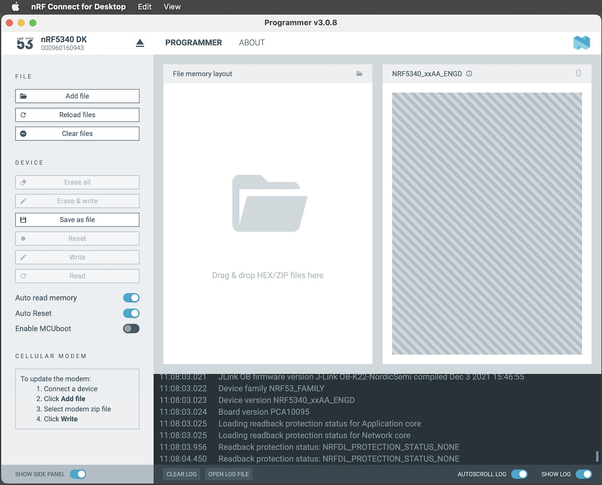
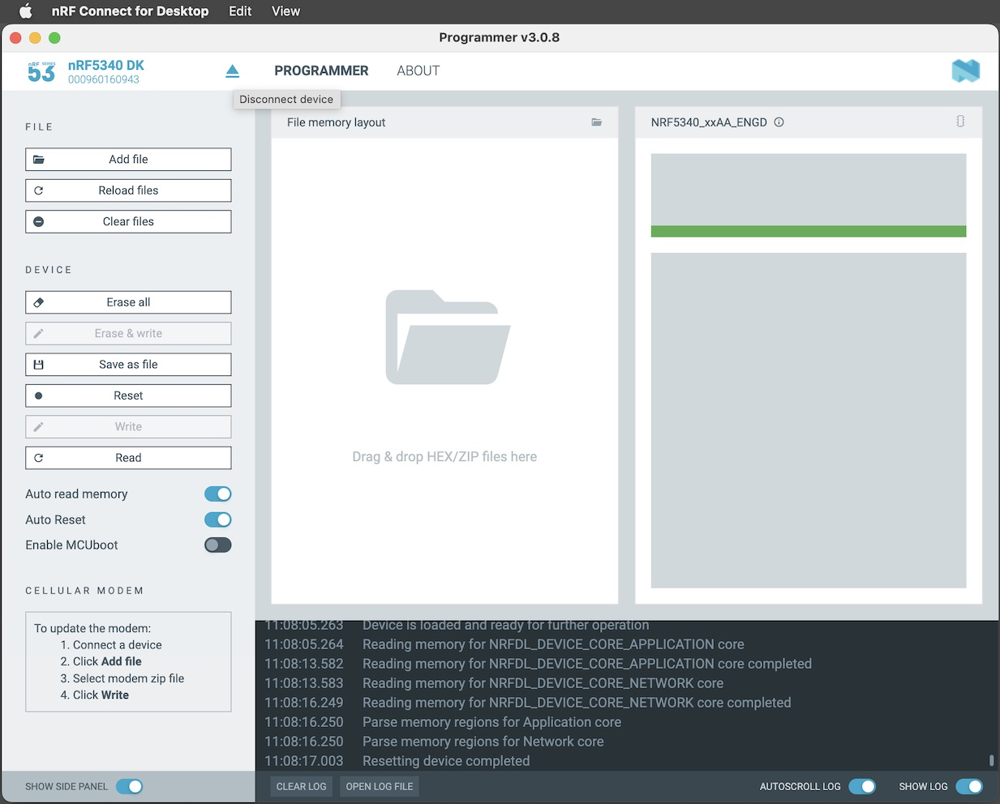
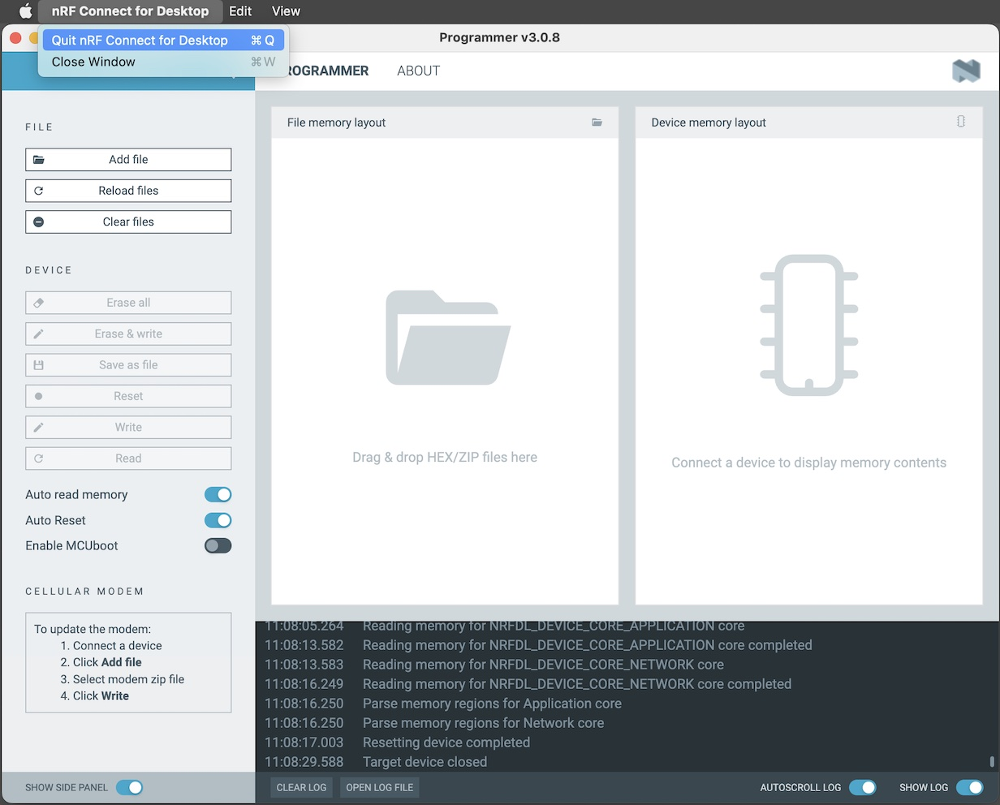

# nRF5340 Flash ROM初期化手順書

最終更新日：2024/06/28

nRF5340のFlash ROM初期化手順について掲載します。

[nRF Connect for Desktop](https://www.nordicsemi.com/Products/Development-tools/nrf-connect-for-desktop/download)のProgrammerというアプリを使用すると、nRF5340のFlash ROMに書き込まれているプログラムやデータ等が一括削除できます。

## nRF5340に接続

まずはProgrammerを起動します。 
nRF Connect for Desktopを起動し、下図のアプリ一覧から「Programmer」を選択し「Open」をクリックします。

Programmerが起動します。 
画面左上部の「SELECT DEVICE」を実行します。

一覧にnRF5340がリストされるので、nRF5340を選択します。

nRF5340と接続されます。 
その後、接続されたnRF5340のFlash ROM内容の参照処理が自動的に開始されます。

下図のように、Flash ROM内容の参照結果が右側のグラフに表示されます。

これで、nRF5340との接続は完了となります。

## nRF5340を初期化

Programmer画面左部メニューの「Erase all」を実行します。

初期化処理が開始し、nRF5340のFlash ROMに書き込まれているプログラムやデータ等が一括削除されます。

初期化処理が完了したら、その後、nRF5340との接続を解除します。 
画面左上部の三角印のアイコン「Disconnect device」をクリックします。

接続を解除したら「Quit nRF Connect for Desktop」をクリックし、Programmerを終了します。

以上で、nRF5340の初期化は完了になります。
