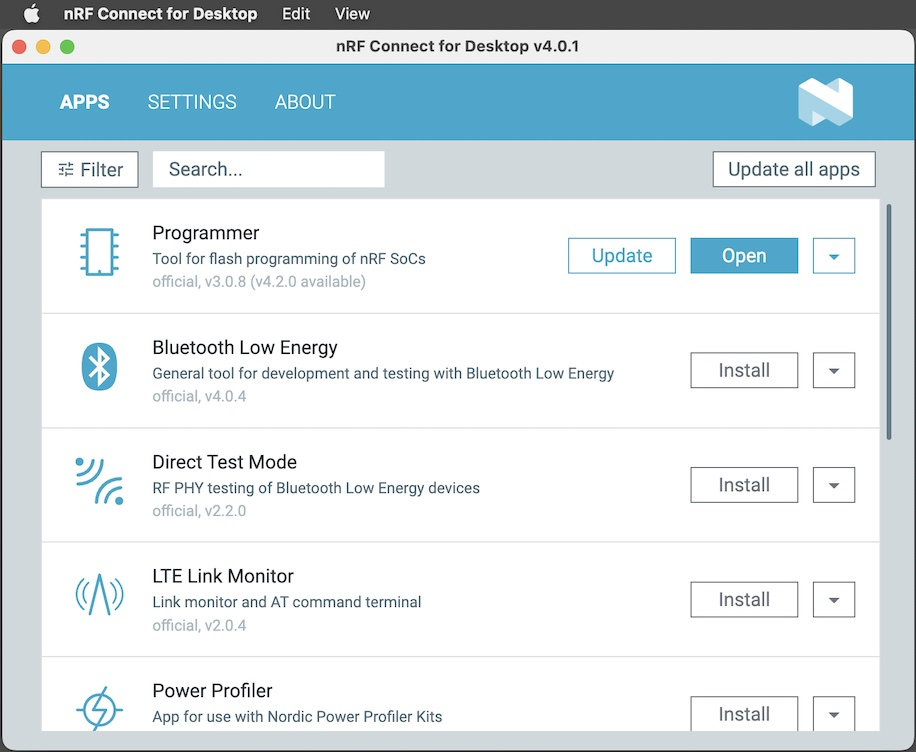
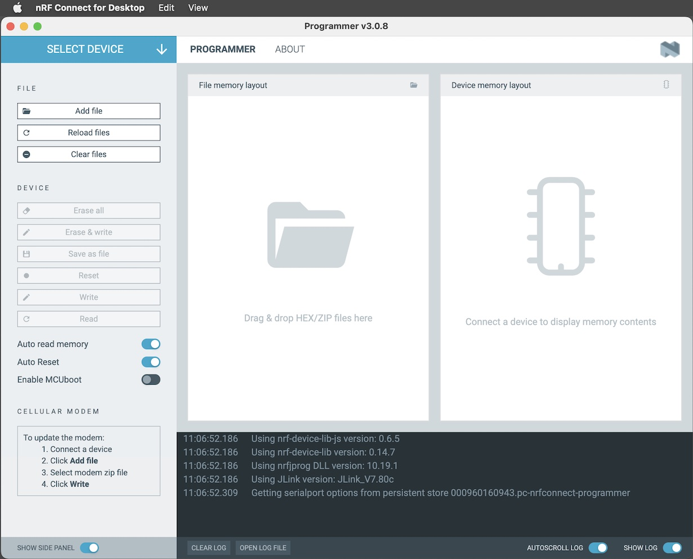
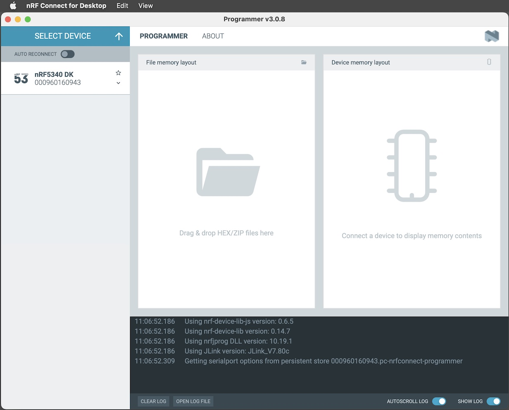
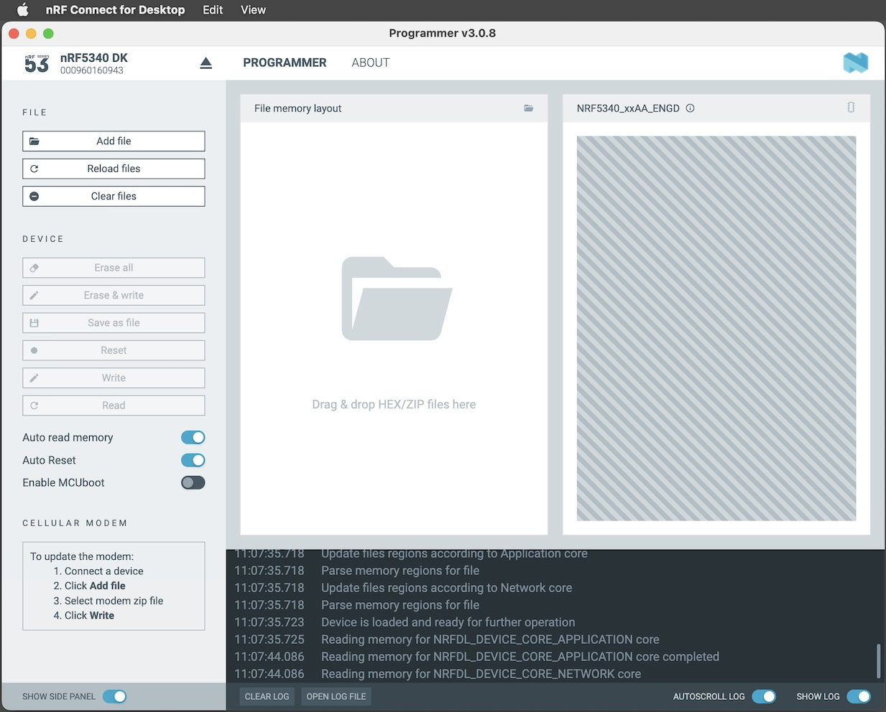
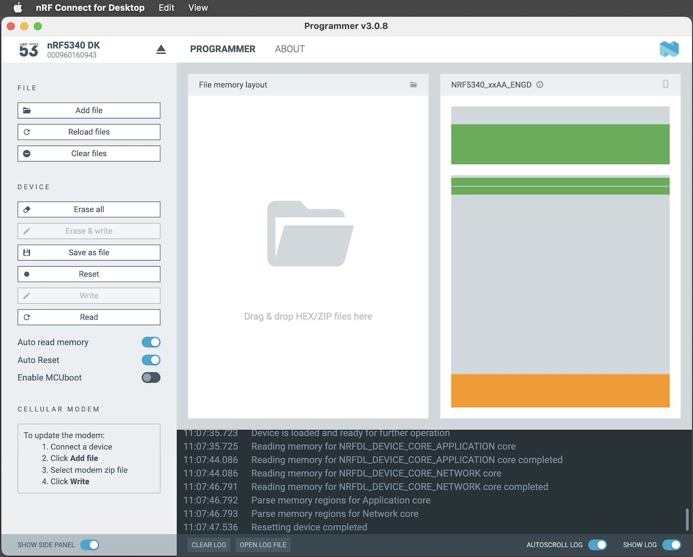

# nRF5340 DK初期化手順書

最終更新日：2024/02/15

[nRF5340 DK](https://www.nordicsemi.com/Products/Development-hardware/nrf5340-dk)のFlash ROMの初期化手順について掲載します。

[nRF Connect for Desktop](https://www.nordicsemi.com/Products/Development-tools/nrf-connect-for-desktop/download)のProgrammerというアプリを使用すると、nRF5340のFlash ROMに書き込まれているプログラムやデータ等が一括削除できます。

## nRF5340 DKに接続

まずはProgrammerを起動します。 
nRF Connect for Desktopを起動し、下図のアプリ一覧から「Programmer」を選択し「Open」をクリックします。

Programmerが起動します。 
画面左上部の「SELECT DEVICE」を実行します。

一覧にnRF5340 DKがリストされるので、nRF5340 DKを選択します。

nRF5340 DKと接続されます。 
その後、接続されたnRF5340 DKのFlash ROM内容の参照処理が自動的に開始されます。

下図のように、Flash ROM内容の参照結果が右側のグラフに表示されます。

これで、nRF5340 DKとの接続は完了となります。
